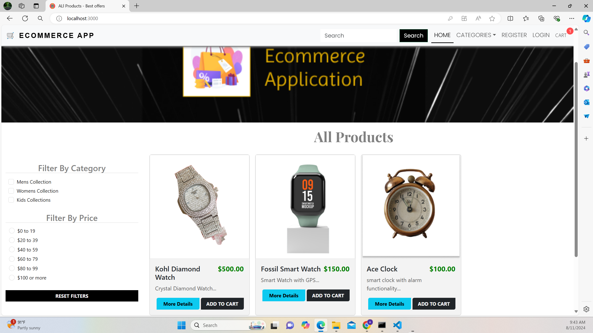
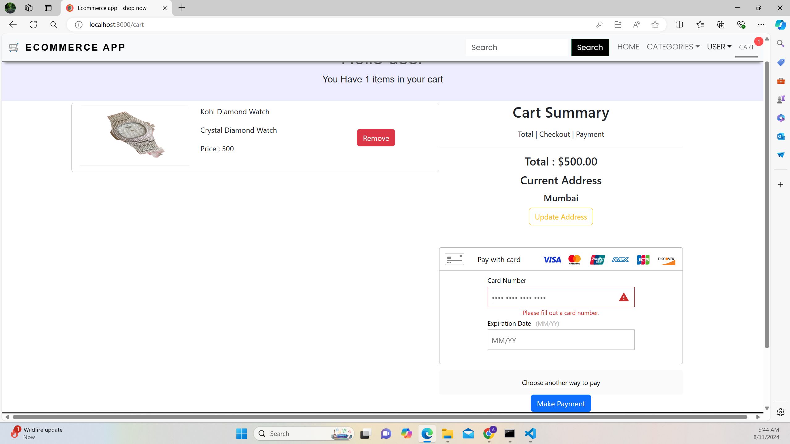
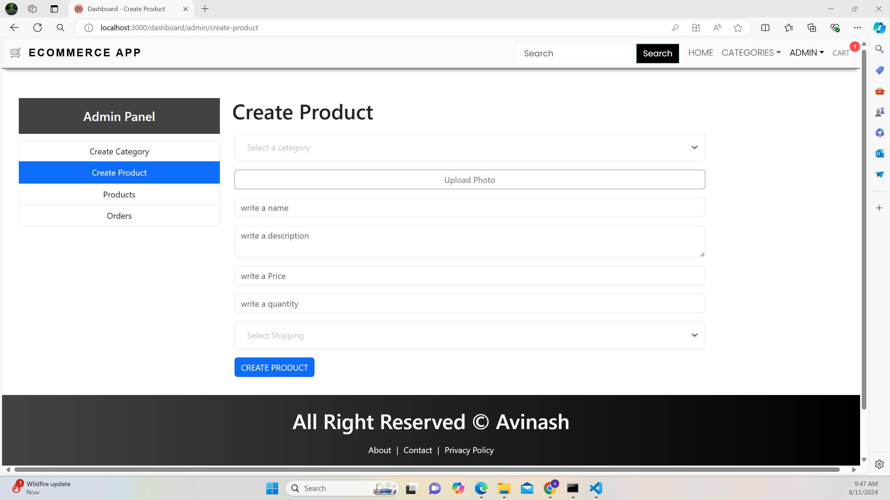

# Retail Rush: E-Commerce Website

## Overview

Retail Rush is a dynamic and user-friendly e-commerce website built using React for the front end and Node.js for the backend. The platform allows users to browse, select, and purchase various products with a seamless shopping experience. It includes essential features such as product management, a shopping cart, secure checkout, and an admin panel for product and category management.

## Features

### User Features
- **Product Browsing:** Users can explore a variety of products displayed on the homepage.
- **Product Categories:** Products are organized into different categories, enabling easy navigation.
- **Shopping Cart:** Users can add items to their cart, view cart details, update quantities, and proceed to checkout.
- **Secure Checkout:** Integration with payment gateways for secure transactions.
- **User Authentication:** Users can register, login, and manage their profiles.

### Admin Features
- **Product Management:** Admins can add, edit, and delete products through an intuitive interface.
- **Category Management:** Admins can create and manage product categories.
- **Order Management:** View and manage customer orders.

## Screenshots

### Home Page
   

### Shopping Cart
   

### Admin Panel
   

## Technologies Used

### Frontend
- **React:** A JavaScript library for building user interfaces.
- **Bootstrap:** Used for responsive design and styling.
- **Axios:** For making API requests.

### Backend
- **Node.js:** A JavaScript runtime built on Chrome's V8 engine.
- **Express.js:** A web application framework for Node.js.
- **MongoDB:** A NoSQL database used to store product, user, and order information.
- **Mongoose:** An ODM for MongoDB and Node.js.

### Payment Integration
- **BrainTree:** For processing payments securely.

## Installation

### Prerequisites
- Node.js and npm installed on your machine.
- MongoDB database set up (locally or on a cloud service).

### Steps to Run Locally
1. **Clone the Repository**
   ```bash
   git clone https://github.com/avinashkodali/retail-rush.git
   cd retail-rush
   ```

2. **Install Dependencies**
   ```bash
   npm install
   cd client
   npm install
   ```

3. **Set Up Environment Variables**
   Create a `.env` file in the root directory and add your MongoDB URI and payment gateway keys.

4. **Run the Server**
   ```bash
   npm run server
   ```

5. **Run the Client**
   In another terminal window, run:
   ```bash
   npm run client
   ```

6. **Access the Website**
   Open your web browser and navigate to `http://localhost:3000`.

## Deployment

For deployment, ensure that environment variables are configured correctly and that the server and client are both set to run in production mode.

### Deploying on Heroku
1. **Set up the Heroku App**
   ```bash
   heroku create
   ```

2. **Deploy the Application**
   ```bash
   git push heroku main
   ```

3. **Set Environment Variables on Heroku**
   ```bash
   heroku config:set VAR_NAME=value
   ```

## Contributing

Contributions are welcome! Please fork the repository and submit a pull request for any improvements or bug fixes.

## License

This project is licensed under the MIT License - see the LICENSE file for details.

## Contact

For any questions or suggestions, please contact the project maintainer at avinashkodali9@gmail.com.
